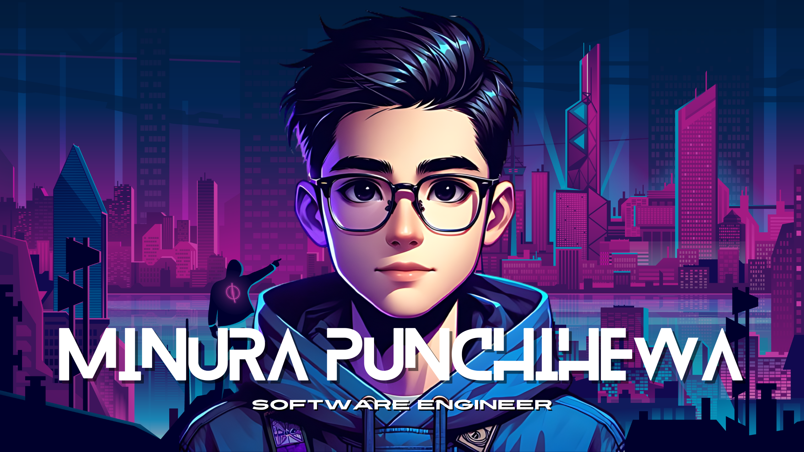

  

  
Hello, World 👋,

I identify primarily as a Software Engineer, but I often don the hat of a Data Engineer when the need arises.

I'm here to build cool things, break a few (responsibly), and learn something new every step of the way. Whether it's my own project or someone else’s, my goal is to leave a trail of show-stopping bugs, occasional breakthroughs, and contributions that make people wonder, "Who built this?!".
That will be my legacy.

- 💻✨💪 Stuff I think I am good at: Python, SQL, Spark, Databricks, Docker and Azure.
- 🌱📚🤞 Stuff I want to be good at: Rust, GraphQL, TypeScript.

&nbsp;

 

